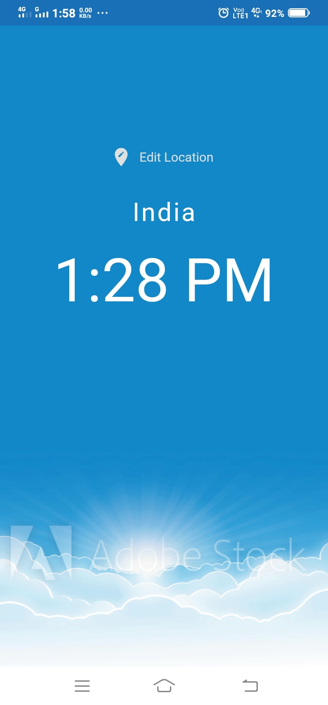

# worldclock

### A new Flutter Application that shows the time of different countries.

### App architecture :

-   This is a multi page app consist of :
    -   Loading page (spinner)
    -   Homepage
    -   Location page (to show the list of location)
-   Entry point of app :

```dart
import 'package:flutter/material.dart';
import 'package:worldclock/packages/choose_location.dart';
import 'package:worldclock/packages/loading.dart';
import 'package:worldclock/packages/home.dart';

void main()=>runApp(MaterialApp(
  debugShowCheckedModeBanner: false,
  initialRoute: '/',
  routes: {
    '/':(context) => Loading(),
    '/home':(context) => Home(),
    '/location':(context) => ChooseLocation(),
  },
));
```

# This app look like:





# Getting Started

This project is a starting point for a Flutter application.

A few resources to get you started if this is your first Flutter project:

-   [Lab: Write your first Flutter app](https://flutter.dev/docs/get-started/codelab)
-   [Cookbook: Useful Flutter samples](https://flutter.dev/docs/cookbook)

For help getting started with Flutter, view our
[online documentation](https://flutter.dev/docs), which offers tutorials,
samples, guidance on mobile development, and a full API reference.
